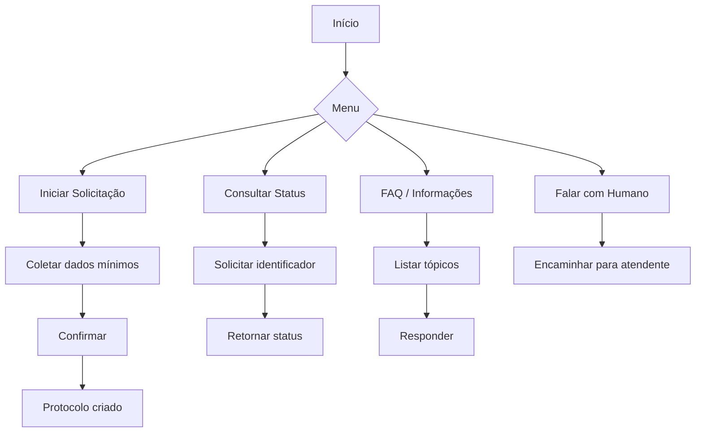

# Fluxos do Chatbot (Telegram e WhatsApp)

## Menu Principal (MVP – Telegram)

Mensagens devem ser curtas, com botões quando possível.

---

## Fluxo de Handoff

1) Usuário escolhe “Falar com Humano” ou cai em fallback
2) Gerar ticket com histórico resumido (últimas N mensagens)
3) Encaminhar para e-mail/desk no MVP; backoffice no MRP
4) Registrar hora de abertura, SLA e atributo responsável

---

## WhatsApp (MRP)

- Adicionar canal WhatsApp Cloud API com as mesmas rotas do Telegram
- Manter consistência de mensagens e contexto compartilhado

