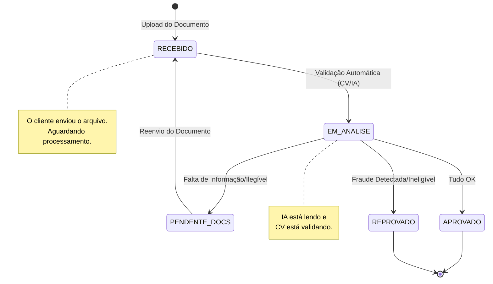

# Fluxo de Estados - YOUVISA

## Transições e Gatilhos

| Origem | Destino | Gatilho | Ação do Sistema |
|---|---|---|---|
| `*` | `RECEBIDO` | Upload via API | Registrar data, Notificar "Recebido" |
| `RECEBIDO` | `EM_ANALISE` | Job de Processamento | Iniciar validação CV + IA |
| `EM_ANALISE` | `APROVADO` | IA Confidence > 80% | Notificar aprovação, Gerar Voucher |
| `EM_ANALISE` | `PENDENTE_DOCS` | IA Confidence < 80% | Notificar erro, Solicitar reenvio |
| `EM_ANALISE` | `REPROVADO` | Fraude/Invalidez | Notificar negativa, Encerrar |
